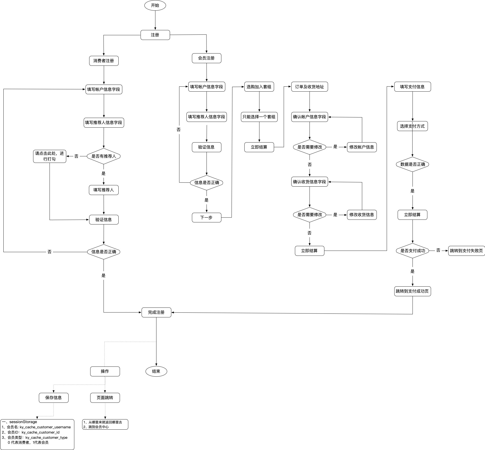
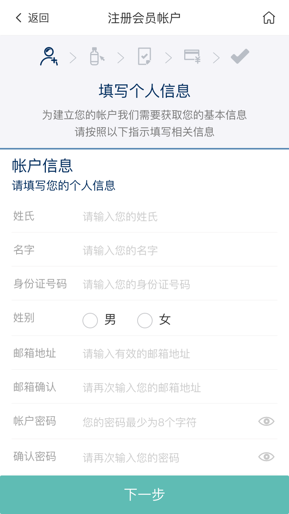

# 会员注册模块

<!-- TOC -->

- [会员注册模块](#会员注册模块)
  - [注册流程](#注册流程)
  - [页面展示 - 步骤一](#页面展示---步骤一)
  - [页面初始化](#页面初始化)
  - [功能介绍](#功能介绍)
    - [1、下一步](#1下一步)
  - [选择套组](#选择套组)
  - [确认订单及填写收货地址](#确认订单及填写收货地址)
    - [引用组件](#引用组件)
    - [订购人信息](#订购人信息)
    - [收货信息](#收货信息)
    - [立即结算](#立即结算)

<!-- /TOC -->


## 注册流程


## 页面展示 - 步骤一


## 页面初始化
当前页面使用了vue.js

当前模块代码位于[AccountRegmember.vue](https://gitlab.kyani.cn/kyani-inc/kyani-shop-mobile/blob/master/src/views/account/AccountRegmember.vue)

注册会员需要先在`vuex`里定义基础数据。

在[account.js](https://gitlab.kyani.cn/kyani-inc/kyani-shop-mobile/blob/master/src/store/modules/account.js)定义vuex数据
```js
const accountRule = {
  firstName: '', // 姓
  lastName: '', // 名
  gender: '', // 性别
  email: '', // 邮箱
  confirmEmail: '', // 确认邮箱
  password: '', // 密码
  confirmPwd: '', // 确认密码
  phoneNumber: '', // 手机号
  telNumber: '', // 固定电话
  idCard: '', // 身份证号码
  cityValue: [], // 省市区数据
  addrDetail: '', // 详细地址
  postcode: '', // 邮政编码
  recommender: '', // 推荐人编号
  reRecommender: '', // 确认推荐人(安置人)
  registerOrderNumber: '' // 注册会员订单编号(重新下单用)
}
// 收货信息表单数据
const receiptRule = {
  consigneeName: '', // 收货人姓名
  idCard: '', // 身份证号码
  phoneNumber: '', // 手机号
  telNumber: '', // 固定电话
  postcode: '', // 邮政编码
  cityValue: [], // 省市区数据
  addrDetail: '' // 详细地址
}

const account = {
  state: {
    accountRule: accountRule, // 会员注册基本信息
    receiptRule: receiptRule, // 会员注册地址信息
  },
}

export default account
```

需要在`store/index`里引入该文件
```js
import Vue from 'vue'
import Vuex from 'vuex'
import account from './modules/account'
import getters from './getters'

Vue.use(Vuex)

const store = new Vuex.Store({
  modules: {
    app,
    account
  },
  getters
})

export default store
```

页面初始化
```js 
created() {
  this.initUserDealer()  // 初始化会员数据
},
```

## 功能介绍

### 1、下一步
  - 点击此按钮调用[submitForm](https://gitlab.kyani.cn/kyani-inc/kyani-shop-mobile/blob/master/src/views/account/AccountRegmember.vue#L399)函数对用户输入的所有字段进行验证

  - 如果全部正确则通过调用[_checkDealerReg](https://gitlab.kyani.cn/kyani-inc/kyani-shop-mobile/blob/master/src/views/account/AccountRegmember.vue#L426)验证用户输入的信息，接口用的是[CheckDealerReg](https://gitlab.kyani.cn/kyani-inc/kyani-shop-mobile/blob/master/src/api/urls.js#L18)，信息正确页面自动跳到下一步的`选购加入套组`
  
  - 验证完成后将数据保存到本地`Session Storage`和`Vuex`,执行的函数是[_saveAccountLocal](https://gitlab.kyani.cn/kyani-inc/kyani-shop-mobile/blob/master/src/views/account/AccountRegmember.vue#L479)。保存好数据，这样其它页面就可以共用数据。

## 选择套组

当前模块代码位于[AccountRegselectpack.vue](https://gitlab.kyani.cn/kyani-inc/kyani-shop-mobile/blob/master/src/views/account/AccountRegselectpack.vue)

在页面创建时生命周期`created`调用函数[getGroupReg](https://gitlab.kyani.cn/kyani-inc/kyani-shop-mobile/blob/master/src/views/account/AccountRegselectpack.vue#L48)获取套组列表数据后并渲染到页面上

点击`选择此套组`按钮调用函数[handleSelectPack](https://gitlab.kyani.cn/kyani-inc/kyani-shop-mobile/blob/master/src/views/account/AccountRegselectpack.vue#L70)选取后会跳转到订单结算页

想更改当前选择的套组，直接切换自己想要购买的套组即可

## 确认订单及填写收货地址

当前模块代码位于[AccountRegorder.vue](https://gitlab.kyani.cn/kyani-inc/kyani-shop-mobile/blob/master/src/views/account/AccountRegorder.vue)

### 引用组件

```js
import RegSteps from './components/RegSteps'
import PackItem from './components/PackItem'
import RegTitle from './components/RegTitle'
import KyDeliveryOrder from '@/components/business/KyDeliveryOrder'
```

确认订单及填写收货地址主要有`订购人信息`、`收货信息`和`立即结算按钮`

当面页面需要通过调用函数[getCartOrderData](https://gitlab.kyani.cn/kyani-inc/kyani-shop-mobile/blob/master/src/views/account/AccountRegorder.vue#L417)获取获取订单数据

这些所有的资料都是在用户输入的表单自动生成的，如用户需要更改信息，可在当前页面进行修改即可。最终提交的资料会以当前页面的为准。


### 订购人信息
函数[getCartOrderData](https://gitlab.kyani.cn/kyani-inc/kyani-shop-mobile/blob/master/src/views/account/AccountRegorder.vue#L417)获取获取订单数据，会返回订购人年额度已用免税金额，利用这个金额跟年额度提示信息可在页面显示当前订购人的已用免税金额。

用户需要更改订购人信息，直接在当面表单直接修改即可，修改完会调用[checkYearAmount](https://gitlab.kyani.cn/kyani-inc/kyani-shop-mobile/blob/master/src/views/account/AccountRegorder.vue#L489)函数实时去验证用户所填的订购人是否满足年额度需求

### 收货信息
收货信息是根据用户在第一步表单提交时自动生成的数据。页面定义数据如下：

```js
// 收货信息表单数据
receiptRuleForm: {
  consigneeName: '', // 收货人姓名
  idCard: '', // 身份证号码
  phoneNumber: '', // 手机号
  telNumber: '', // 固定电话
  postcode: '', // 邮政编码
  cityValue: [], // 省市区数据
  addrDetail: '' // 详细地址
}
```

用户需要更改收货信息，可在右上角点击`修改`按钮，将弹出修改收货地址的弹出框，输入想要修改的内容后点击`保存`即可

### 立即结算

在页面的右侧可以看到用户选择当前套组的价格信息，在最右下角有一个`立即结算`按钮，立即结算按钮将触发[handleBtnSettleNow](https://gitlab.kyani.cn/kyani-inc/kyani-shop-mobile/blob/master/src/views/account/AccountRegorder.vue#L542)函数，该函数将用户的信息整理好并按照一定的格式提交到后台接口,api用的是[UserDealer](https://gitlab.kyani.cn/kyani-inc/kyani-shop-mobile/blob/master/src/api/urls.js#L9),当接口返回成功的数据后，自动帮助用户登录、清空用户填写的资料。并跳转到支付网关让用户进行支付

用户支付完成或未完成都会返回支付结果页，在支付结果页可以看到自己的用户帐号和支付金额等信息