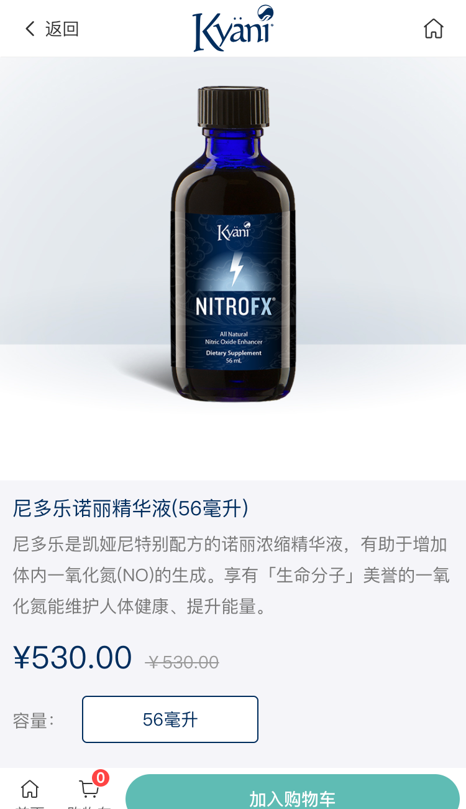

# 商品详情页模块
  商品详情页模块
<!-- TOC -->

- [商品详情页模块](#商品详情页模块)
  - [页面展示](#页面展示)
  - [Components](#components)
  - [函数及调用接口](#函数及调用接口)
  - [功能介绍](#功能介绍)

<!-- /TOC -->
## 页面展示

## Components
[ProductList.vue](ttps://gitlab.kyani.cn/kyani-inc/kyani-shop-mobile/blob/master/src/views/home/components/ProductList.vue)

## 函数及调用接口
[Detail.vue](https://gitlab.kyani.cn/kyani-inc/kyani-shop-mobile/blob/master/src/views/home/Detail.vue)

在Vue页面 `mounted` 生命周期钩子时分别调用以下几个函数：
- [getDetail](ttps://gitlab.kyani.cn/kyani-inc/kyani-shop-mobile/blob/master/src/views/home/Detail.vue#L152) 获取到当前详情页的数据后并渲染到页面上。

- 获取当前页商品所关联的数据列表,数据是通过[getPruductRelation](ttps://gitlab.kyani.cn/kyani-inc/kyani-shop-mobile/blob/master/src/views/home/Detail.vue#L283)函数获得关联产品

- 初始化及自动选择sku[skuCheckItem](ttps://gitlab.kyani.cn/kyani-inc/kyani-shop-mobile/blob/master/src/views/home/Detail.vue#L250)

`getDetail`是通过[ProductInfoId接口](https://gitlab.kyani.cn/kyani-inc/kyani-shop-mobile/blob/master/src/api/urls.js#L28)获取数据

`getPruductRelation`是通过[pruductRelation接口](https://gitlab.kyani.cn/kyani-inc/kyani-shop-mobile/blob/master/src/api/urls.js#L62)获取数据

## 功能介绍

- 1、购买数量增减，点击`加减`按钮，当前商品数量会进去变化。最小为`0`，最大为`99`
  
- 2、选择产品的SKU,是通过函数[handleSelectSku](ttps://gitlab.kyani.cn/kyani-inc/kyani-shop-mobile/blob/master/src/views/home/Detail.vue#L293)实现，用户可根据自己需求选择SKU产品
  
- 3、`加入购物车`是通过函数[handleAddCart](ttps://gitlab.kyani.cn/kyani-inc/kyani-shop-mobile/blob/master/src/views/home/Detail.vue#L298)实现。如果用户没有登录，会自动跳到登录页面，待用户登录完成后会自动加入购物车，并自动更新购物车数量

- 4、关联产品是通过函数[getPruductRelation](ttps://gitlab.kyani.cn/kyani-inc/kyani-shop-mobile/blob/master/src/views/home/Detail.vue#L283)获取到数据，并渲染到页面上
  