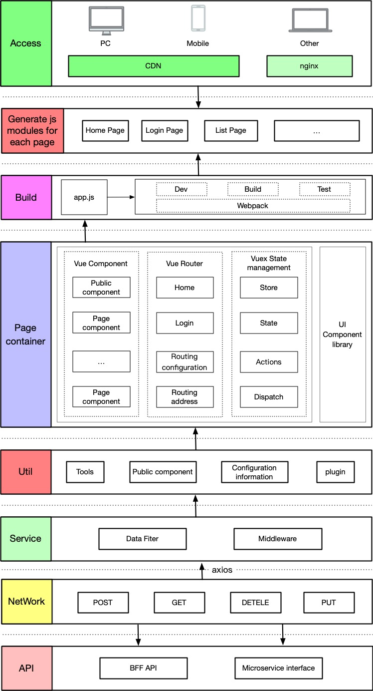

# 系统架构
kyani商城系统Mobile端是采用vue cli3 + vue + vuex + vue-router + vant + webpack 等一系列成熟的技术开发而成。在保证安全的前提下，又能快速响应公司各部门提出的需求进而快速开发。

## 技术概览
- Vue cli3: Vue 脚手架工具）
- Vue2.6.x：前端渐进式框架
- Vuex：专为 Vue.js 应用程序开发的状态管理模式
- vue-router: 是官方提供的路由器
- ES6+：采用ES6+语法，箭头函数、async/await等等语法
- SASS(SCSS)：用SCSS做CSS预处理语言，可以使用最高效的方式，以少量的代码创建复杂的设计
- vant： 基于 Vue 2.0 的Mobile端组件库
- axios：用来请求后端api数据
- FastClick:（解决移动端 300ms 点击延迟）
  

## 目录结构
``` bash
├── README.md                  // 项目说明文档
├── babel.config.js            // babel-loader 配置
├── bin                        // 脚本配置
├── docs                       // 文档记录
├── package-lock.json          // package-lock.json
├── package.json               // package.json
├── prod.serve.js              // 本地启动配置
├── public                     // 静态资源
├── src                        // 源代码
│   ├── api                    // 所有请求
│   ├── assets                 // 主题 字体等静态资源
│   ├── components             // 全局公用组件
│   ├── directive              // 全局指令
│   ├── filters                // 全局 filter
│   ├── icons                  // 项目所有 svg icons
│   ├── router.js              // 路由
│   ├── store                  // vuex 的状态管理
│   │   ├── actions.js         // 配置 actions
│   │   ├── getters.js         // 配置 getters
│   │   ├── index.js           // 引用 vuex，创建 store
│   │   ├── mutation-types.js  // 定义常量 mutations 名
│   │   ├── mutations.js       // 配置 mutations
│   │   └── state.js           // 配置 state
│   ├── styles                 // 全局样式
│   ├── utils                  // 全局公用方法
│   ├── vendor                 // 公用vendor
│   ├── views                  // views 所有页面
│   ├── App.vue                // 入口页面
│   ├── main.js                // 入口文件 加载组件 初始化等
│   ├── vant-ui.js             // vant-ui配置文件
└── vue.config.js              // vue-cli 配置文件
```

## 前端架构及工程化图
