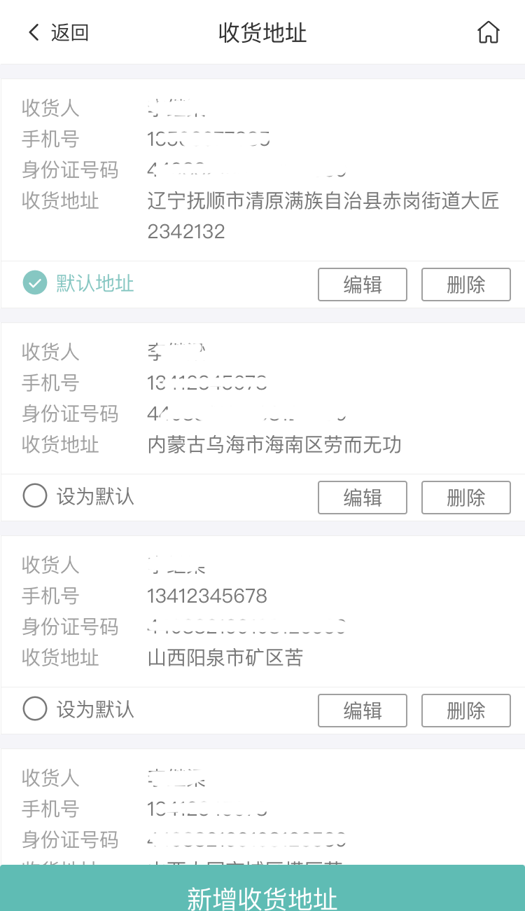

# 收货地址管理模块

地址管理模块是用户收货地址管理的统一管理页面。包含的功能有：地址列表、新增地址、删除地址、修改地址

目前限制用户只能增加8条收货地址。


<!-- TOC -->

- [收货地址管理模块](#收货地址管理模块)
  - [页面展示](#页面展示)
  - [函数及调用接口](#函数及调用接口)
  - [功能介绍](#功能介绍)
    - [添加新地址](#添加新地址)
    - [修改地址](#修改地址)
    - [删除地址](#删除地址)

<!-- /TOC -->

## 页面展示




## 函数及调用接口

路由定义

```js
{
    path: '/user',
    component: Layout,
    redirect: '/user/index',
    children: [{
      path: 'index',
      name: 'UserIndex',
      component: () => import('@/views/user/UserIndex'),
      meta: {
        requireAuth: true,
        title: '我的'
      }
    },
}
```

[UserAddress.vue](https://gitlab.kyani.cn/kyani-inc/kyani-shop-mobile/blob/master/src/views/user/UserAddress.vue)

在Vue页面 `methods` 生命周期钩子时分别调用以下几个函数：
- [getAddressList](https://gitlab.kyani.cn/kyani-inc/kyani-shop-mobile/blob/master/src/views/user/UserAddress.vue#L109) 获取到当前用户收货地址的数据后并渲染到页面上。

`getAddressList`是通过[getAddressList接口](https://gitlab.kyani.cn/kyani-inc/kyani-shop-mobile/blob/master/src/api/urls.js#L26)获取数据

引入组件
```js
import AddressActionsheet from '@/components/business/AddressActionsheet'
```

## 功能介绍

### 添加新地址
  - 添加地址将调用[handleNewAddress](https://gitlab.kyani.cn/kyani-inc/kyani-shop-mobile/blob/master/src/views/user/UserAddress.vue#L129)函数,调起 `kyAddressDialog` 组件弹出层，初始化定义如下：

  ```js
  const initAddressData = {
    id: '', // 地址id
    consignee: '', // 收货人姓名
    idCard: '', // 身份证号码
    phoneNumber: '', // 手机号
    telNumber: '', // 固定电话
    postcode: '', // 邮政编码
    cityValue: [], // 省市区数据
    addrDetail: '', // 详细地址
    isDefault: false // 是否为默认地址
  }
  ```
  - 根据页面的提交填写完所有信息，点击保存验证通过即可添加地址成功

### 修改地址
   - 修改地址将调用[handleEtidAddress](https://gitlab.kyani.cn/kyani-inc/kyani-shop-mobile/blob/master/src/views/user/UserAddress.vue#L156)函数,调起 `kyAddressDialog` 组件弹出层，进行内容编辑。填写完按保存按钮即可
  
### 删除地址
   - 删除地址将调用[handleDeleteAddress](https://gitlab.kyani.cn/kyani-inc/kyani-shop-mobile/blob/master/src/views/user/UserAddress.vue#L185)函数,需要传入当前需要删除的地址id，函数会询问是否确定要删除地址。确实后将进行地址删除
  