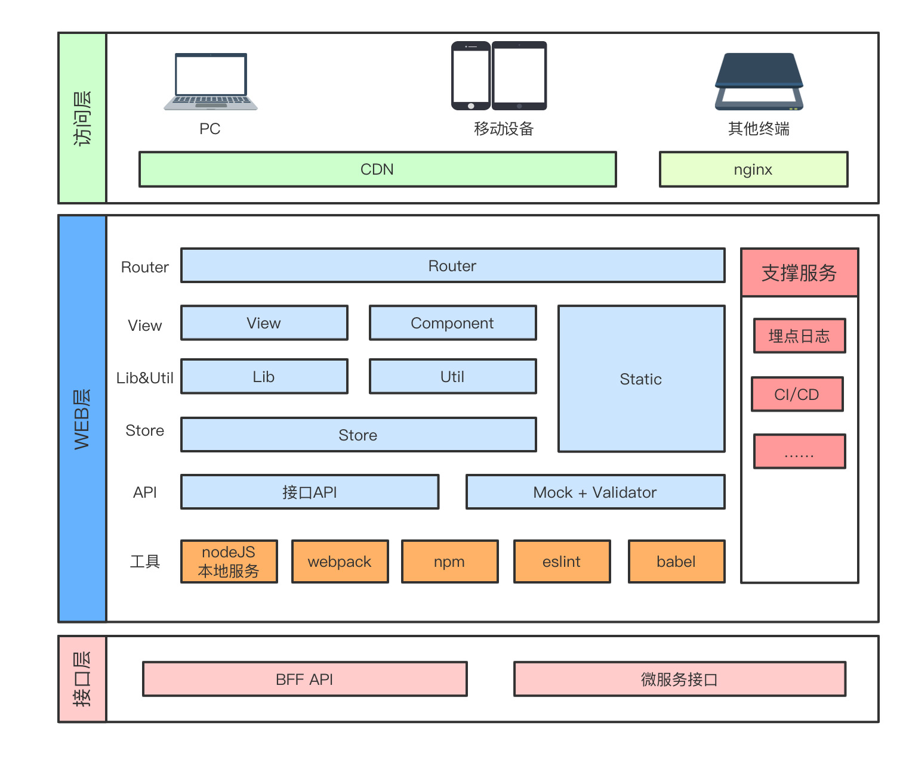

# 系统架构
kyani商城系统PC端是采用vue + vuex + vue-router + element-ui + webpack 等一系列成熟的技术开发而成。在保证安全的前提下，又能快速响应公司各部门提出的需求进而快速开发。

## 技术概览
- Vue2.5.x：前端渐进式框架
- Vuex：专为 Vue.js 应用程序开发的状态管理模式
- vue-router: 是官方提供的路由器
- ES6+：采用ES6+语法，箭头函数、async/await等等语法
- SASS(SCSS)：用SCSS做CSS预处理语言，可以使用最高效的方式，以少量的代码创建复杂的设计
- element-ui： 基于 Vue 2.0 的桌面端组件库
- axios：用来请求后端api数据
- webpack: 一个模块打包器

## 目录结构
``` bash
├── build                      // 构建相关
├── config                     // 配置相关
├── src                        // 源代码
│   ├── api                    // 所有请求
│   ├── assets                 // 主题 字体等静态资源
│   ├── components             // 全局公用组件
│   ├── directive              // 全局指令
│   ├── filters                // 全局 filter
│   ├── icons                  // 项目所有 svg icons
│   ├── router                 // 路由
│   ├── store                  // 全局 store管理
│   ├── styles                 // 全局样式
│   ├── utils                  // 全局公用方法
│   ├── vendor                 // 公用vendor
│   ├── views                  // views 所有页面
│   ├── App.vue                // 入口页面
│   ├── main.js                // 入口文件 加载组件 初始化等
├── static                     // 第三方不打包资源
├── .babelrc                   // babel-loader 配置
├── .eslintrc.js               // eslint 配置项
├── .gitignore                 // git 忽略项
├── .travis.yml                // 自动化CI配置
├── favicon.ico                // favicon图标
├── index.html                 // html模板
└── package.json               // package.json
```

## 前端架构及工程化图
