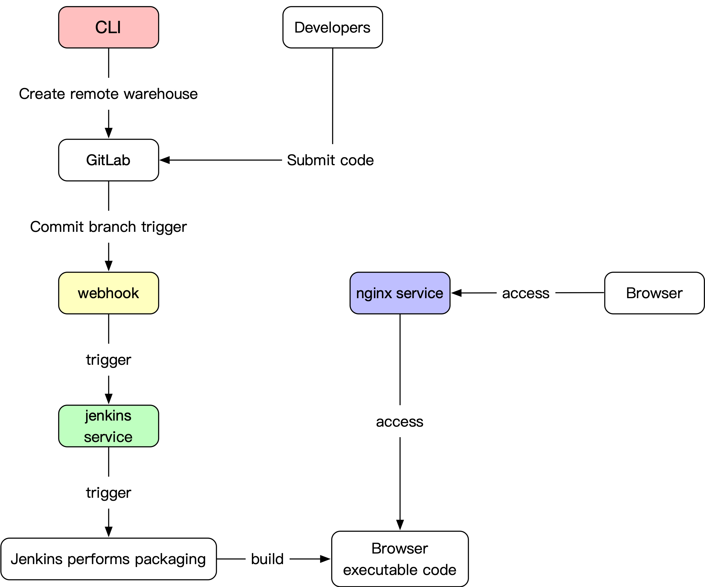

# 部署

## 商城Pc部署
商城的是基于vue开发

vue -> v2.5.17

打包正式环境命令，编译项目

``` bash
# 包安装
npm install 

# 打包正式环境
npm run build:prod
```
执行完上命令，会生成一个`dist`目录。基于生成的`dist`目录，在本机装好nginx后，只需要配置`nginx.conf`文件指向到当前`dist`目录下启动nginx即可


### jenkins实现自动化部署

jenkins的构建环境需要安装 NodeJS -> v9.0.0

使用基于docker+jenkins+nginx自动化部署的方案。

这种方式只需要开发者将代码push到git,git的webhook会自动触发jenkins服务进行包安装，然后进行自动打包，打好包后jenkins会在服务器上根据脚本自动创建好docker容器。

发布脚本在根目录下的 `bin` 里面


Build
```
npm install
npm run build
cd ./dist/ 
sleep 1s
sudo tar -zcvf ../shop_pc_clinet.zip *
```

SSH Publishers
```
sudo mkdir /data/www
sudo mkdir /data/www/shop_pc_clinet
sudo tar -xvf /home/centos/release/shop_pc_clinet/shop_pc_clinet.zip -C  /data/www/shop_pc_clinet/
sudo chmod 777 /data/www/shop_pc_clinet/bin/run-prod.sh
sudo chmod 777 /data/www/shop_pc_clinet/bin/docker-run-prod.sh
sudo sh /data/www/shop_pc_clinet/bin/docker-run-prod.sh
```

## 商城Mobile部署
商城的是基于vue开发,脚手架用vue-cli

vue -> v2.6.11

打包正式环境命令，编译项目

``` bash
# 包安装
npm install 

# 打包正式环境
npm run prod-build
```
执行完上命令，会生成一个`dist`目录。基于生成的`dist`目录，在本机装好nginx后，只需要配置`nginx.conf`文件指向到当前`dist`目录下启动nginx即可

### jenkins实现自动化部署

jenkins的构建环境需要安装 NodeJS -> v9.0.0

使用基于docker+jenkins+nginx自动化部署的方案。

这种方式只需要开发者将代码push到git,git的webhook会自动触发jenkins服务进行包安装，然后进行自动打包，打好包后jenkins会在服务器上根据脚本自动创建好docker容器。

发布脚本在根目录下的 `bin` 里面

Build
```
npm install -g @vue/cli
npm install 
npm run prod-build
cd ./dist/ 
sleep 1s
sudo tar -zcvf ../shop_mobile_clinet.zip *
```

SSH Publishers
```
sudo mkdir /data/www
sudo mkdir /data/www/shop_mobile_clinet
sudo tar -xvf /home/centos/release/shop_mobile_clinet/shop_mobile_clinet.zip -C  /data/www/shop_mobile_clinet/
sudo chmod 777 /data/www/shop_mobile_clinet/bin/run-prod.sh
sudo chmod 777 /data/www/shop_mobile_clinet/bin/docker-run-prod.sh
sudo sh /data/www/shop_mobile_clinet/bin/docker-run-prod.sh
```