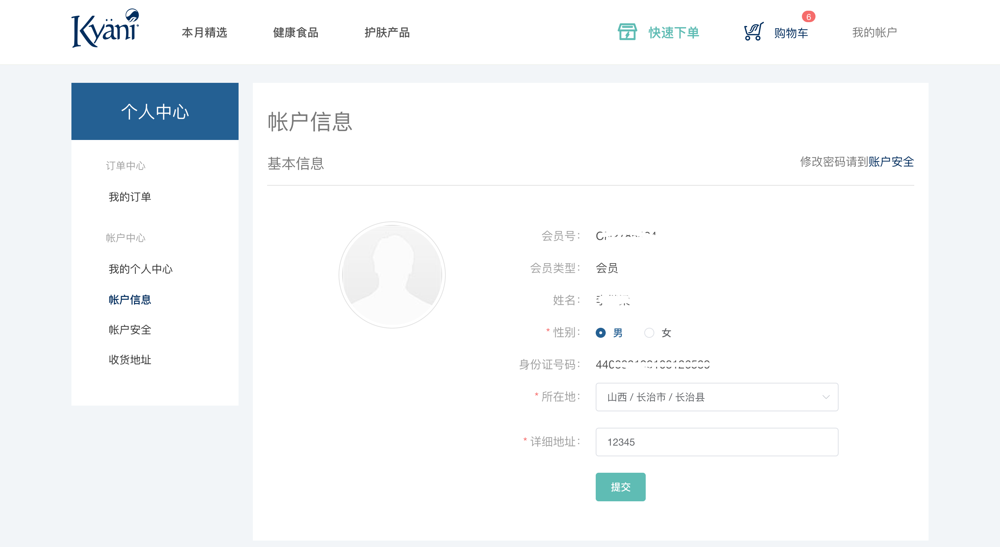

# 帐户信息模块

帐户信息是显示用户的基本信息，内容包括：会员号、会员类型、姓名、性别、身份证号码、所在地、详细地址

用户可以在这里对自己个人信息进行更改

<!-- TOC -->

- [帐户信息模块](#帐户信息模块)
  - [页面展示](#页面展示)
  - [函数及调用接口](#函数及调用接口)
    - [修改用户信息](#修改用户信息)

<!-- /TOC -->

## 页面展示



## 函数及调用接口

用户中心页面需要用户新的布局方式`LayoutUser`，在vue-router里面设置如下：

左侧的导航布局包含在`LayoutUser`里面

```js
import LayoutUser from '../views/layout/LayoutUser'

export const constantRouterMap = [
  {
    path: '/user',
    component: LayoutUser,
    redirect: '/user/index',
    children: [{
      path: 'index',
      name: 'UserBasicinfo',
      component: () => import('@/views/user/UserBasicinfo'),
      meta: {
        requireAuth: true,
        title: '帐户信息'
      }
    },
    {
      ...
    }
  }
]
```

[UserBasicinfo.vue](https://gitlab.kyani.cn/kyani-inc/kyani-shop-pc/blob/master/src/views/user/UserBasicinfo.vue)

在Vue页面 `mounted` 生命周期钩子时分别调用以下几个函数：
- [getData](https://gitlab.kyani.cn/kyani-inc/kyani-shop-pc/blob/master/src/views/user/UserBasicinfo.vue#L66) 获取到当前用户信息的数据后并渲染到页面上。

- 用户信息通过调用[getData](https://gitlab.kyani.cn/kyani-inc/kyani-shop-pc/blob/master/src/views/user/UserBasicinfo.vue#L102) 获取到当前用户信息的数据并显示在到页面上。

### 修改用户信息

- 能修改的用户信息有： 性别、身份证号码、所在地、详细地址
- 直接在页面上填写好需要修改的信息，然后接`提交`按钮，即可以修改用户信息
- `提交`按钮将调用 [submitForm]()(https://gitlab.kyani.cn/kyani-inc/kyani-shop-pc/blob/master/src/views/user/UserBasicinfo.vue#L130) 函数 
