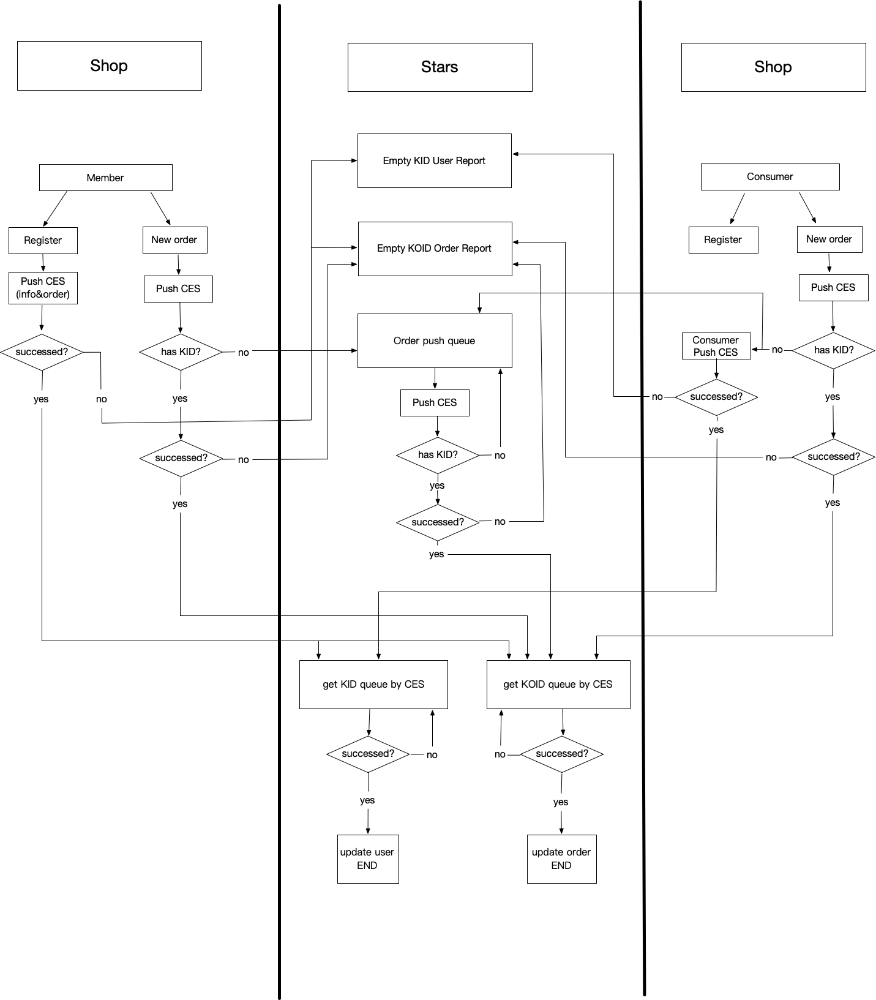

# CES模块

## Stars to CES workflow



## 接口介绍

```java
/**
* 新消费者
* @param userId
*/
boolean newCustomer(Long userId) throws Exception;
/**
* 新会员
* @param orderNumber
* @return
*/
boolean newMember(String orderNumber)  throws Exception;
/**
* 新订单
* @param orderNumber
*/
boolean newOrder(String orderNumber)  throws Exception;
/**
* 更新用户信息
* @return
*/
boolean updateUser(Long userId)  throws Exception;
/**
* 更新密码
* @return
*/
boolean updatePassword(Long userId,String newPwd)  throws Exception;
/**
* 获取并更新到会员KID
* @returng
*/
String generateKid(String cnid,boolean addRecord) throws Exception;
/**
* 查询所有有效无KID的会员，获取并更新KID
* @returng
*/
List<String> generateKid(Set<String> cnids, boolean addRecord)  throws Exception;
/**
* 获取并更新到订单koid
* @returng
*/
String generateKoid(String orderNumber,String cnid,boolean addRecord)  throws Exception;
/**
* 查询所有有效无koid的订单，获取并更新koid
* @returng
*/
List<String> generateKoid(Map<String,String> paramsMap, boolean addRecord)  throws Exception;

/**
* 验证并获取推荐人KID
* @param code
* @return
*/
String checkReference(String code,boolean addRecord) throws Exception;
/**
* 验证并获取安置人KID
* @return
*/
String checkPlacement(String code,String recommenerKid,boolean addRecord) throws Exception;
```