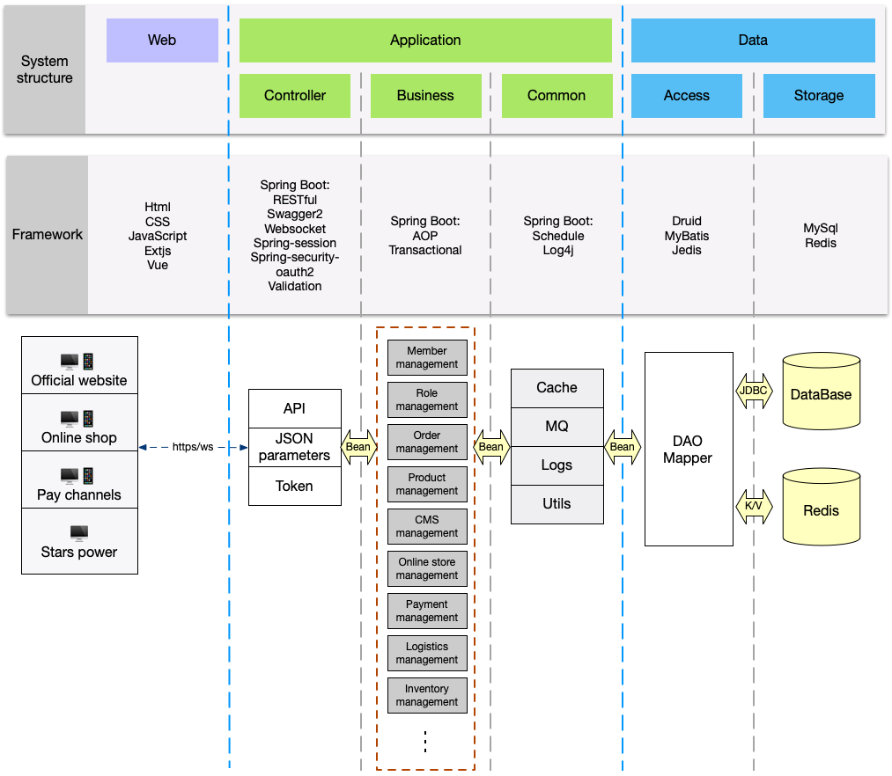

# 系统架构

## 目录结构
``` 
├── stars.power.common                  // 公共工具模块
├── stars.power.core                    // 核心代码模块
├── stars.power.molecule                // 各业务model模块
├── stars.power.ces                     // CES模块
├── stars.power.cms                     // CMS模块，官网信息
├── stars.power.infrastructure          // 基础信息模块
├── stars.power.logistics               // 物流模块，一键清关
├── stars.power.market                  // 推广模块，优惠券
├── stars.power.message                 // 信息模块，如发送短信，邮件
├── stars.power.order                   // 订单模块
├── stars.power.product                 // 产品模块
├── stars.power.report                  // 自定义报表模块
├── stars.power.sync                    // Freedom同步模块（已停用）
├── stars.power.websocket               // websocket处理模块
├── stars.power.task.light              // 定时任务Api
├── stars.power.monitor.customsWS       // 海关实时数据抓取模块
├── stars.power.monitor.light           // 海关实时数据抓取WS工具
├── stars.power.officialSite.light      // 官网Api
├── stars.power.payment                 // 支付模块
├── stars.power.payment.light           // 支付系统Api
├── stars.power.shop.security           // 商城权限模块
├── stars.power.shop.user               // 会员模块
├── stars.power.shop.light              // 商城Api
├── stars.power.admin.security          // Stars后台管理权限模块
├── stars.power.admin.user              // Stars后台管理用户模块
├── stars.power.admin.light             // Stars后台管理Api
│   ├── src/main/assembly               // 配置项目打包时需要附加的文件
│   ├── src/main/java                   // Api接口类、项目启动类
│   ├── src/main/resources              // 项目配置文件
│   ├── src/main/scripts                // 脚本文件

```

## 系统架构及工程化图
