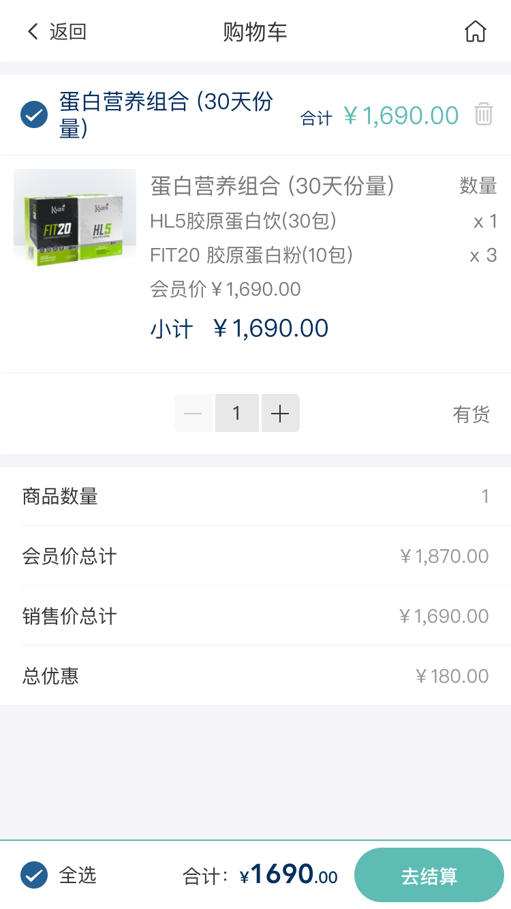

# 购物车模块

购物车是用户下单的集合点，用户所有加入的商品都在购物车中。当前页面是需要用户先登录才能进到购物车列表页

购物车我们需要实现的功能有如下功能点：

展示购物车列表、向购物车列表中添加商品（add）、修改购物车列表中商品的数量、删除列表中的商品

<!-- TOC -->

- [购物车模块](#购物车模块)
  - [页面展示](#页面展示)
  - [Components](#components)
  - [函数及调用接口](#函数及调用接口)
  - [功能介绍](#功能介绍)
    - [1、购物车加减功能](#1购物车加减功能)
    - [2、删除商品功能](#2删除商品功能)
    - [3、单选、多选和全选功能](#3单选多选和全选功能)
    - [4、立即结算](#4立即结算)

<!-- /TOC -->

## 页面展示



## Components
[KyOrderside.vue](https://gitlab.kyani.cn/kyani-inc/kyani-shop-mobile/blob/master/src/components/business/KyOrderside/index.vue)

[KyOrderLayout.vue](https://gitlab.kyani.cn/kyani-inc/kyani-shop-mobile/blob/master/src/components/business/KyOrderLayout/index.vue)

## 函数及调用接口

购物车列表页
[CartIndex.vue](https://gitlab.kyani.cn/kyani-inc/kyani-shop-mobile/blob/master/src/views/cart/CartIndex.vue)

购物车-核对订单页
[CartOrder.vue](https://gitlab.kyani.cn/kyani-inc/kyani-shop-mobile/blob/master/src/views/cart/CartOrder.vue)

在Vue页面创建 `created` 时调用 [getCartList](https://gitlab.kyani.cn/kyani-inc/kyani-shop-mobile/blob/master/src/views/cart/CartIndex.vue#L179) 根据用户token获取到当前用户的购物车列表数据后并渲染到页面上

`getCartList`是通过[CartList接口](https://gitlab.kyani.cn/kyani-inc/kyani-shop-mobile/blob/master/src/api/urls.js#L23)获取数据

先在定义全局`store`数据
```js
const cart = {
  state: {
    cartCount: 0, // 购物车总数
    cartIds: getCartIds() || [], // 购物车id
    cartSkuList: getCartSkuList() || [], // 下单sku列表
    cartTradeNo: getCartTradeNo() || '' // 下单成功后的订单id,用于返回支付结果页
  }
}
```
## 功能介绍

### 1、购物车加减功能
 
- 购物车加减是通过函数[handleChangeQuantity](https://gitlab.kyani.cn/kyani-inc/kyani-shop-mobile/blob/master/src/views/cart/CartIndex.vue#L201)实现
- 用户按下按钮会post请求后台接口加入购物车，通过接口返回的列表数据进行渲染购物车列表，并重新计算用户选择的商品的金额总数及积分信息

### 2、删除商品功能

- 删除商品是通过[handleDeleteCartId](https://gitlab.kyani.cn/kyani-inc/kyani-shop-mobile/blob/master/src/views/cart/CartIndex.vue#L220)函数实现
- 该函数需要传入需要删除的商品Id,通过商品id去请求后台数据，即可成功删除商品。删除完商品重新获取一下购物车列表接口重新渲染购物车列表

### 3、单选、多选和全选功能
- 单选及多选是通过[handleCheckedcartListChange](https://gitlab.kyani.cn/kyani-inc/kyani-shop-mobile/blob/master/src/views/cart/CartIndex.vue#L171)函数实现，该函数需要传当前购物车的id进行选择商品。选择完后调用计算价格总数函数进行总数及价格的计算。
  
  功能实现如下：
  ```js
    handleCheckedcartListChange(value) {
        this.checkAll = checkedCount === this.cartList.length
        this.isIndeterminate = checkedCount > 0 && checkedCount < this.cartList.length

        this._computedTotal()
    },
  ```
  - 全选是通过[handleCheckAllChange](https://gitlab.kyani.cn/kyani-inc/kyani-shop-mobile/blob/master/src/views/cart/CartIndex.vue#L156)函数实现。
  - 全选是函数是先判断如果已经有一个商品选择了，则那么就全部选中。如果全部选中了，则会是取消全选

  ```js
  // 全选
    handleCheckAllChange(val) {
      const selectList = []
      const _cartList = this.cartList
      for (let i = 0; i < _cartList.length; i++) {
        // 如果商品已经下架，则不需要选中
        if (_cartList[i].isSales) {
          selectList.push(_cartList[i].id)
        }
      }
      this.checkedcartList = val ? selectList : []
      this.isIndeterminate = false

      this._computedTotal()
    }
  ```

### 4、立即结算
- 立即结算是由[handleBtnSettlement](https://gitlab.kyani.cn/kyani-inc/kyani-shop-mobile/blob/master/src/views/cart/CartIndex.vue#L280)函数实现。该函数会筛选出选中的所有购物车列表id，然后根据所选的购物车列表id去及sku列表信息去提交数据到后端api接口。
- 后台接口返回数据正确后则自己跳转到购物车订单核对页。


