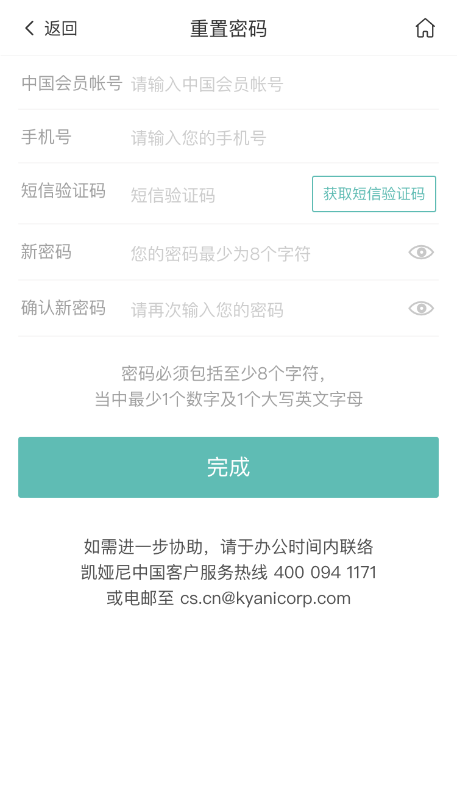

# 忘记密码模块
当用户忘记了用户密码，即可通过忘记密码模块通过注册时会员帐号和手机号即可更换新密码。

<!-- TOC -->

- [忘记密码模块](#忘记密码模块)
  - [页面展示](#页面展示)
  - [函数及调用接口](#函数及调用接口)
  - [功能介绍](#功能介绍)
    - [1、获取短信验证码](#1获取短信验证码)
    - [2、完成](#2完成)

<!-- /TOC -->

## 页面展示

## 函数及调用接口
当前页面使用了vue.js

当前模块代码位于[AccountForgetpwd.vue](https://gitlab.kyani.cn/kyani-inc/kyani-shop-mobile/blob/master/src/views/account/AccountForgetpwd.vue)

## 功能介绍

### 1、获取短信验证码 
  - 点击此按钮调用[handleGetCaptcha](https://gitlab.kyani.cn/kyani-inc/kyani-shop-mobile/blob/master/src/views/account/AccountForgetpwd.vue#L190)函数对用户输入的用户名和手机号进行验证
  - 如果全部正确则通过接口获致验证码发送到手机，输入短信验证码后进去下一步

### 2、完成
  - 通过前面的步骤，再输入新密码即可点击`完成`按钮，通过调用[submitForm](https://gitlab.kyani.cn/kyani-inc/kyani-shop-mobile/blob/master/src/views/account/AccountForgetpwd.vue#L150)函数对数据进行验证，数据全部正确通过post到后台，将由后台返回是否成功修改的标识。