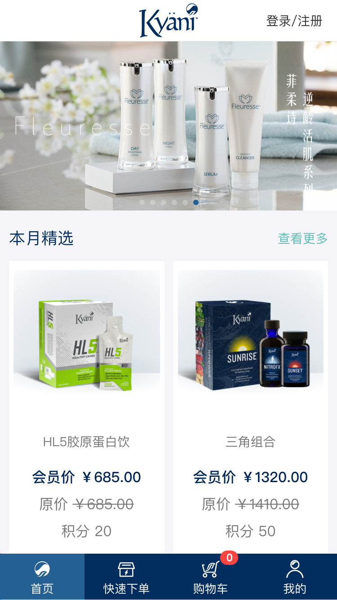

# 首页模块

首页

<!-- TOC -->

- [首页模块](#首页模块)
  - [页面展示](#页面展示)
  - [Components](#components)
  - [函数及调用接口](#函数及调用接口)
  - [功能介绍](#功能介绍)
    - [1、快速下单](#1快速下单)
    - [2、购物车](#2购物车)
    - [3、登录/注册](#3登录注册)
    - [4、banner](#4banner)
    - [5、查看更多](#5查看更多)
    - [6、商品](#6商品)

<!-- /TOC -->

## 页面展示

## Components

[ProductList.vue](https://gitlab.kyani.cn/kyani-inc/kyani-shop-mobile/blob/master/src/views/home/components/ProductList.vue)

## 函数及调用接口
当前页面使用了vue.js

[Home.vue](https://gitlab.kyani.cn/kyani-inc/kyani-shop-mobile/blob/master/src/views/home/Home.vue)

在Vue页面创建 `created` 时调用 [getHomeData](https://gitlab.kyani.cn/kyani-inc/kyani-shop-mobile/blob/master/src/views/home/Home.vue#L94) 获取到页面的banner跟商品列表数据后并渲染到页面上

`getHomeData`是通过[Home接口](https://gitlab.kyani.cn/kyani-inc/kyani-shop-mobile/blob/master/src/api/urls.js#L22)获取数据

## 功能介绍

### 1、快速下单
 
- 如果用户没有登录页面会自动先跳转到登录页面，待用户登录成功后自动返回快速下单页
- 如果用户已经登录，直接跳转到快速下单页

### 2、购物车

- 如果用户没有登录页面会自动先跳转到登录页面，待用户登录成功后自动返回购物车页，并自动更新用户的购物车数量
- 如果用户已经登录，直接跳转到购物车

### 3、登录/注册
- 点击可直接到登录页面，在登录页面上可以进行用户登录。也可以跳转到注册页面、忘记密码页

### 4、banner
- 通过获取到的数据渲染`banner`,后台设置了如果有跳转链接点击后直接跳转过去

### 5、查看更多
- 目前产品有本月精选、健康食品、护肤产品三大类，点击`查看更多`跳到相对应的商品列表页
  
### 6、商品 
- 点击此处可直接跳转到商品详情页

