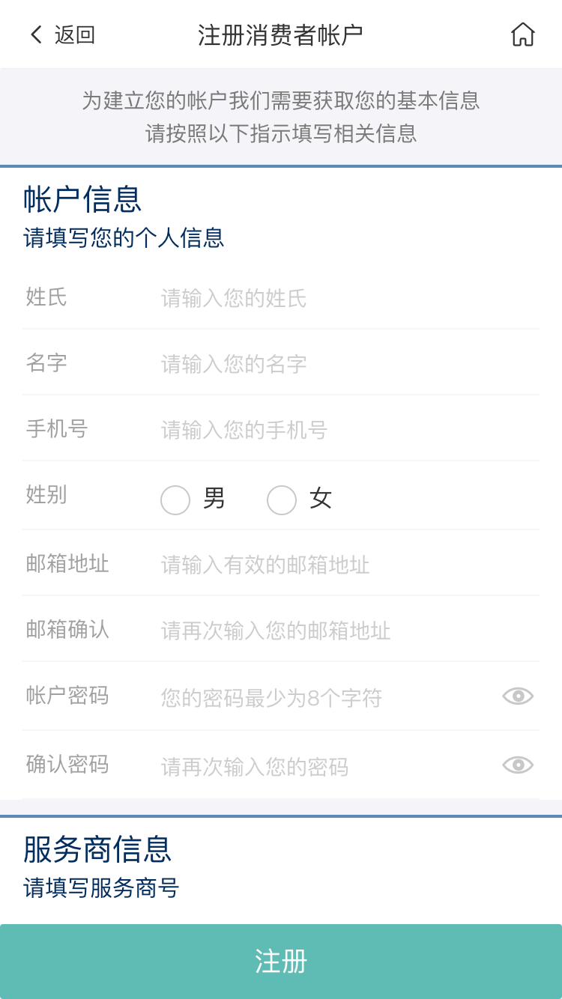

# 消费者注册

<!-- TOC -->

- [消费者注册](#消费者注册)
  - [注册流程](#注册流程)
  - [页面展示](#页面展示)
  - [页面初始化](#页面初始化)
  - [功能介绍](#功能介绍)
    - [1、注册](#1注册)
  - [消费者注册成功](#消费者注册成功)

<!-- /TOC -->

## 注册流程


## 页面展示


## 页面初始化
当前页面使用了vue.js

当前模块代码位于[AccountRegconsumer.vue](https://gitlab.kyani.cn/kyani-inc/kyani-shop-mobile/blob/master/src/views/account/AccountRegconsumer.vue)

消费者注册需要填写用户的基本信息才可以注册

在`data`中定义的字段
```js
ruleForm: {
  userName: '', // 中国会员帐号
  mobile: '', // 手机号
  captcha: '', // 短信验证码
  newPassword: '', // 密码
  confirmPwd: '' // 确认密码
}
```
## 功能介绍

### 1、注册
  - 点击此按钮调用[submitForm](https://gitlab.kyani.cn/kyani-inc/kyani-shop-mobile/blob/master/src/views/account/AccountRegconsumer.vue#L246)函数对用户输入的所有字段进行验证

  - 如果全部正确则通过调用[_postRegconsumer](https://gitlab.kyani.cn/kyani-inc/kyani-shop-mobile/blob/master/src/views/account/AccountRegconsumer.vue#L264)函数进行注册消费者

## 消费者注册成功

页面展示


消费者注册成功后会自动跳转到注册成功页，系统会根据用户注册返回的帐号和用户的密码自动帮助用户进行登录。当前页面将显示用户的`消费者帐号`。用户需要记住自己的帐号，方便下一次登录系统。

- 单击`开始购物`系统将跳转到商城首页