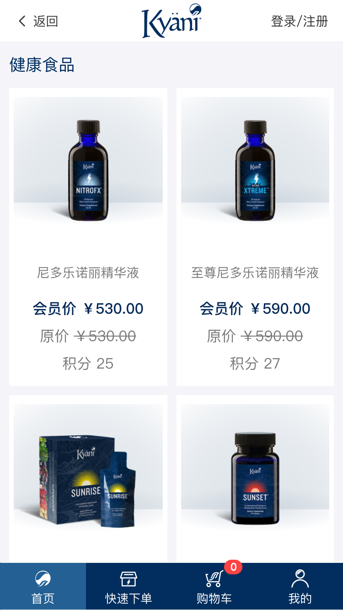

# 商品列表页模块

  商品列表页
<!-- TOC -->

- [商品列表页模块](#商品列表页模块)
  - [页面展示](#页面展示)
  - [Components](#components)
  - [函数及调用接口](#函数及调用接口)
  - [功能介绍](#功能介绍)
    - [6、商品](#6商品)

<!-- /TOC -->
## 页面展示

## Components
[ProductList.vue](https://gitlab.kyani.cn/kyani-inc/kyani-shop-mobile/blob/master/src/views/home/components/ProductList.vue)

## 函数及调用接口
当前页面使用了vue.js

[List.vue](https://gitlab.kyani.cn/kyani-inc/kyani-shop-mobile/blob/master/src/views/home/List.vue)

在Vue页面创建 `created` 时调用 [getProductList](https://gitlab.kyani.cn/kyani-inc/kyani-shop-mobile/blob/master/src/views/home/List.vue#L44) 获取到页面的banner跟商品列表数据后并渲染到页面上

`getProductList`是通过[List接口](https://gitlab.kyani.cn/kyani-inc/kyani-shop-mobile/blob/master/src/api/urls.js#L60)获取数据

## 功能介绍

### 6、商品 
  - 点击此处可直接跳转到商品详情页
