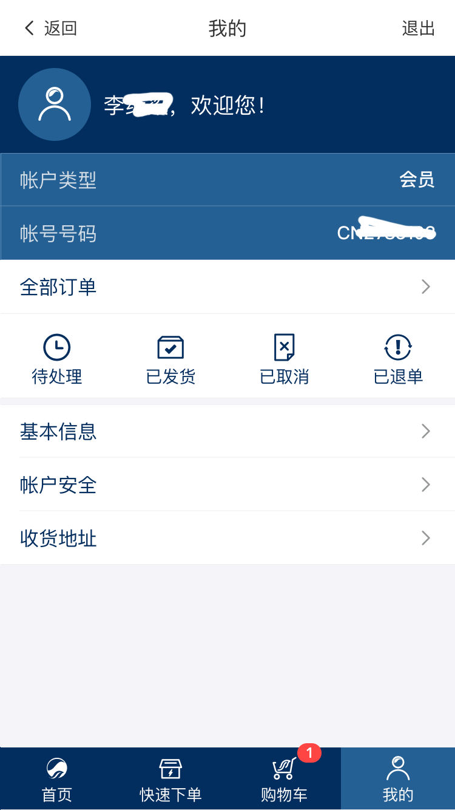

# 用户中心首页模块

用户中心页是用户信息管理与订单管理的快捷入口页。左侧是个人中心的导航页，右侧是信息展示页。

用户中心模块是需要用户登录才可以看得到。如果用户还没登录则会跳转到登录页面，登录后会自动跳转到用户中心页。

所有与用户信息相关的页面都需要登录

<!-- TOC -->

- [用户中心首页模块](#用户中心首页模块)
  - [页面展示](#页面展示)
  - [函数及调用接口](#函数及调用接口)
    - [用户信息](#用户信息)
    - [我的订单](#我的订单)

<!-- /TOC -->

## 页面展示



## 函数及调用接口

用户中心页面需要用户新的布局方式`LayoutUser`，在vue-router里面设置如下：

左侧的导航布局包含在`LayoutUser`里面

```js
import LayoutUser from '../views/layout/LayoutUser'

export const constantRouterMap = [
  {
    path: '/user',
    component: LayoutUser,
    redirect: '/user/index',
    children: [{
      path: 'index',
      name: 'UserIndex',
      component: () => import('@/views/user/UserIndex'),
      meta: {
        requireAuth: true,
        title: '会员中心首页'
      }
    },
    {
      ...
    }
  }
]
```

[UserIndex.vue](https://gitlab.kyani.cn/kyani-inc/kyani-shop-mobile/blob/master/src/views/user/UserIndex.vue)

在Vue页面 `mounted` 生命周期钩子时分别调用以下几个函数：
- [getData](https://gitlab.kyani.cn/kyani-inc/kyani-shop-mobile/blob/master/src/views/user/UserIndex.vue#L66) 获取到当前用户信息的数据后并渲染到页面上。

用户中心页能显示`用户信息`和`我的订单`

### 用户信息
- 用户信息通过调用[getData](https://gitlab.kyani.cn/kyani-inc/kyani-shop-mobile/blob/master/src/views/user/UserIndex.vue#L66) 获取到当前用户信息的数据并显示在到页面上。
- 主要显示的信息有：会员号、身份证号、名字、手机号和邮箱

### 我的订单
- 我的订单主要是快捷链接到订单列表页，主要有：待处理、已完成、已取消、已退单的各订单状态的订单列表页。