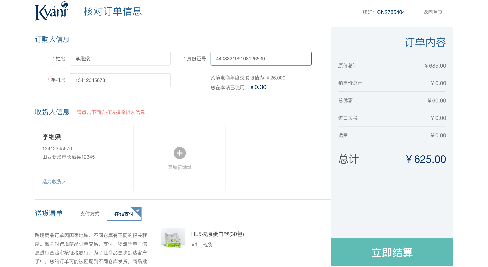

# 核对订单页模块
核对订单页是购物车页跳转过来的，当前页面可以看到最终的商品订单内容

用户可以在这里添加、修改及选择收货信息，可以查看送货清单内容及所有的订单拆单信息。

<!-- TOC -->

- [核对订单页模块](#核对订单页模块)
  - [页面展示](#页面展示)
  - [Components](#components)
  - [函数及调用接口](#函数及调用接口)
  - [功能介绍](#功能介绍)
    - [1、订购人信息](#1订购人信息)
    - [2、收货人信息](#2收货人信息)
    - [3.送货清单](#3送货清单)
    - [4、立即结算](#4立即结算)

<!-- /TOC -->

## 页面展示



## Components
[KyOrderside.vue](https://gitlab.kyani.cn/kyani-inc/kyani-shop-pc/blob/master/src/components/business/KyOrderside/index.vue)

[KyOrderLayout.vue](https://gitlab.kyani.cn/kyani-inc/kyani-shop-pc/blob/master/src/components/business/KyOrderLayout/index.vue)

核对订单页分别引用了以下几个组件

```js
import KyOrderside from '@/components/business/KyOrderside'
import KyOrderLayout from '@/components/business/KyOrderLayout'
import KyDeliveryOrder from '@/components/business/KyDeliveryOrder'
import kyAddressDialog from '@/components/business/kyAddressDialog'
```

## 函数及调用接口

购物车-核对订单页
[CartOrder.vue](https://gitlab.kyani.cn/kyani-inc/kyani-shop-pc/blob/master/src/views/cart/CartOrder.vue)

在Vue页面创建 `created` 时调用 [getCartOrderData](https://gitlab.kyani.cn/kyani-inc/kyani-shop-pc/blob/master/src/views/cart/CartOrder.vue#L465) 根据用户token获取到当前用户的获取订单数据后并渲染到页面上

通过[getAddressList](https://gitlab.kyani.cn/kyani-inc/kyani-shop-pc/blob/master/src/views/cart/CartOrder.vue#L312)获取收货地址列表数据并渲染到页面上

`getCartOrderData`是通过[OrderPreview接口](https://gitlab.kyani.cn/kyani-inc/kyani-shop-pc/blob/master/src/api/urls.js#L29)获取数据


## 功能介绍

### 1、订购人信息
 
- 订购人信息是需要跨镜商品才会显示出来。这里可以修改订购人的信息，修改完会实时验证并显示当前订购人所剩余的年额度

  需要定义订购人显示的一些基本信息
  ```js
    data() {
      return {
        yearLimit: '', // 年度免税额度
        yearLimitErrMessage: '', // 年度免税额度错误信息
      }
    }
  ```
  
- 验证订购人年度已用免税金额的函数是[checkYearAmount](https://gitlab.kyani.cn/kyani-inc/kyani-shop-pc/blob/master/src/views/cart/CartOrder.vue#L266)

### 2、收货人信息
  - 收货人信息默认会显示出当前用户的所有收货地址列表。也可以在这里进去添加地址、删除地址、修改地址
  - 默认会提示用户去选择收货地址，必须选择了收货地址才能提交订单
  
### 3.送货清单
  - 送货清单个显示出所有商品的详情信息
  - 系统会将当前用户的订单自动拆单成不同订单类型并显示在页面上。

### 4、立即结算
- 立即结算是由[handleSettleNow](https://gitlab.kyani.cn/kyani-inc/kyani-shop-pc/blob/master/src/views/cart/CartOrder.vue#L570)函数实现。该函数会验证用户的所有信息
- 需要提交的信息如下：
  ```js
    let _data = {
      buyProducts: this.$store.state.cart.cartSkuList, // 下单产品：id、sku、
      shoppingCartIds: this.$store.state.cart.cartIds, // 购物车ID组
      couponCode: this.couponCode, // 优惠券码 ,
      orderLogistics: { // 收货人信息
        'consigneeAddressProvince': shippingAddress.addrPrivonceName,
        'consigneeAddressCity': shippingAddress.addrCityName,
        'consigneeAddressCounty': shippingAddress.addrCountyName,
        'consigneeAddressDetail': shippingAddress.addrDetail,
        'consigneeAddressZipCode': shippingAddress.postcode,
        'consigneeIDCardNumber': shippingAddress.idCard,
        'consigneeName': shippingAddress.consignee,
        'consigneePhoneNumber': shippingAddress.phoneNumber
      },
      // 以下为订购人信息
      buyerRealName,
      buyerIdCard,
      buyerMobile
    }
  ```
  - 通过[下单接口](https://gitlab.kyani.cn/kyani-inc/kyani-shop-pc/blob/master/src/api/urls.js#L30)提交数据给后端，由后端处理后返回相关数据。

  - 返回正确的数据会自动跳转到支付系统进行支付