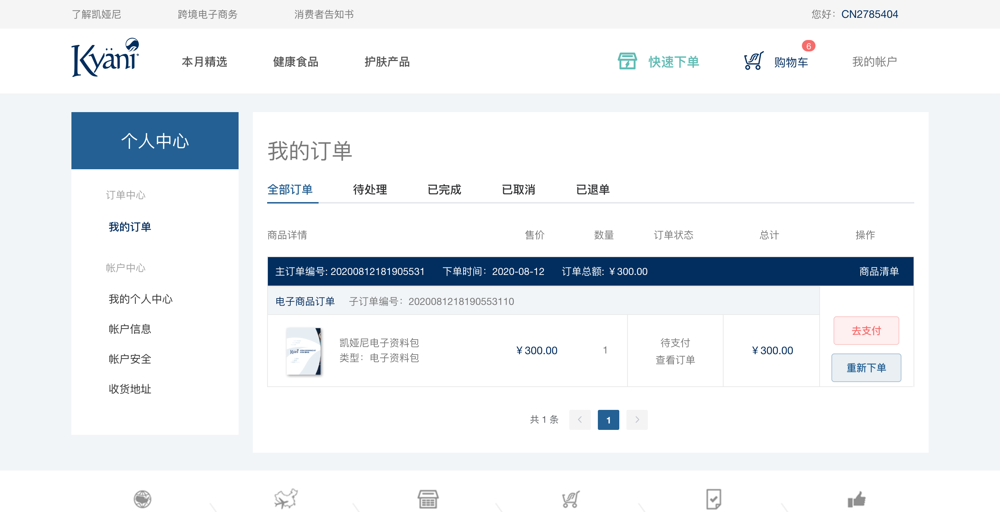

# 订单详情模块

我的订单列表页主要是展示用户下单的所有订单列表。主要的状态有：待处理、已完成、已取消、已退单

不同的状态切换需要在路由上进行体现如：`/user/order/?type=1`，type值为1代表待处理，2为已完成，3为已取消，4为已退单

<!-- TOC -->

- [订单详情模块](#订单详情模块)
  - [页面展示](#页面展示)
  - [函数及调用接口](#函数及调用接口)
  - [功能介绍](#功能介绍)
    - [订单状态](#订单状态)

<!-- /TOC -->

## 页面展示



## 函数及调用接口

我的订单列表页需要用户新的布局方式`LayoutUser`，在vue-router里面设置如下：

左侧的导航布局包含在`LayoutUser`里面

```js
import LayoutUser from '../views/layout/LayoutUser'

export const constantRouterMap = [
  {
    path: '/user',
    component: LayoutUser,
    redirect: '/user/index',
    children: [{
      path: 'index',
      name: 'UserIndex',
      component: () => import('@/views/user/UserIndex'),
      meta: {
        requireAuth: true,
        title: '会员中心首页'
      }
    },
    {
      ...
    }
  }
]
```

[UserOrder.vue](https://gitlab.kyani.cn/kyani-inc/kyani-shop-pc/blob/master/src/views/user/UserOrder.vue)

在Vue页面 `methods` 生命周期钩子时分别调用以下几个函数：
- [getList](https://gitlab.kyani.cn/kyani-inc/kyani-shop-pc/blob/master/src/views/user/UserOrder.vue#L285) 获取到当前用户订单的数据后并渲染到页面上。

初始化定义如下
```js
mounted() {
  const { type } = this.$route.query
  if (type === '1' || type === '2' || type === '3' || type === '4') {
    this.activeName = type
    this.type = type
  } else {
    this.activeName = '0'
    this.type = '0'
  }
  this.getList()
}
```

`getList`是通过[OrderList接口](https://gitlab.kyani.cn/kyani-inc/kyani-shop-pc/blob/master/src/api/urls.js#L36)获取数据

## 功能介绍

### 订单状态
  - 每笔订单都会有相对应的状态。分别有如下状态：去支付、取消订单、申请退款、退款详情、申请退货、退货详情、重新下单

  - 状态会根据api返回的数据根据规则显示不同的状态，在前端页面的判断如下。

  ```html
    <el-button plain v-if="item.permitPayment" type="danger" @click="handlePayAgain(item.number)">&nbsp;去支付&nbsp;</el-button>
    <el-button plain v-if="item.permitCancel" @click="handleCancelType(item.number)">取消订单</el-button>
    <el-button plain type="primary" v-if="item.permitRefund" @click="handleGoPage('/user/refund', item.number)">申请退款</el-button>
    <el-button type="primary" v-if="item.permitRefundDetail"  @click="handleGoPage('/user/refundview', item.number)">退款详情</el-button>
    <el-button plain type="primary" v-if="item.permitReturnGoods"  @click="handleGoPage('/user/return', item.number)">申请退货</el-button>
    <el-button type="primary" v-if="item.permitReturnGoodsDetail"  @click="handleGoPage('/user/returnview', item.number)">退货详情</el-button>
    <el-button type="primary" plain v-if="item.permitReOrder"  @click="handleGoPageReorder('/account/regmember?reorder=true')">重新下单</el-button>
  ```