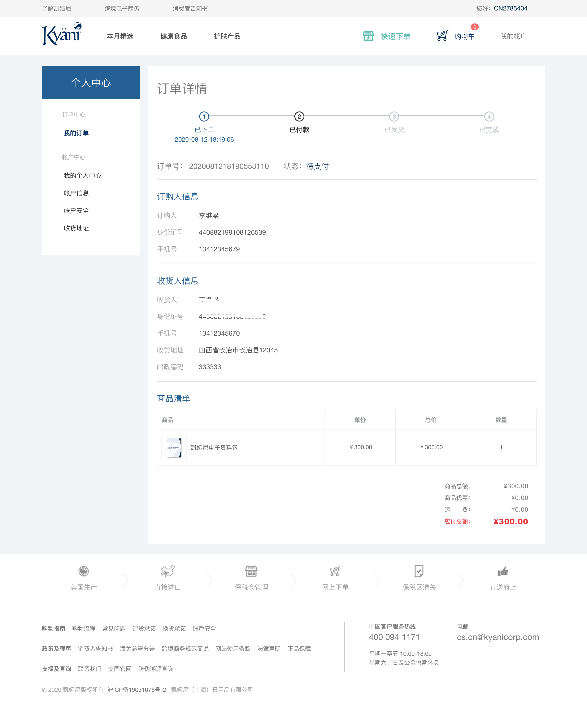

# 订单详情模块

订单详情主要是显示订单的所有信息，包括：当前状态、订购人信息、收货人信息、商品清单、付款信息

<!-- TOC -->

- [订单详情模块](#订单详情模块)
  - [页面展示](#页面展示)
  - [函数及调用接口](#函数及调用接口)
  - [功能介绍](#功能介绍)
    - [订单状态](#订单状态)
    - [其它信息](#其它信息)

<!-- /TOC -->

## 页面展示



## 函数及调用接口

我的订单列表页需要用户新的布局方式`LayoutUser`，在vue-router里面设置如下：

左侧的导航布局包含在`LayoutUser`里面

```js
import LayoutUser from '../views/layout/LayoutUser'

export const constantRouterMap = [
  {
    path: '/user',
    component: LayoutUser,
    redirect: '/user/index',
    children: [{
      path: 'index',
      name: 'UserIndex',
      component: () => import('@/views/user/UserIndex'),
      meta: {
        requireAuth: true,
        title: '会员中心首页'
      }
    },
    {
      ...
    }
  }
]
```

[UserOrderview.vue](https://gitlab.kyani.cn/kyani-inc/kyani-shop-pc/blob/master/src/views/user/UserOrderview.vue)

在Vue页面 `methods` 生命周期钩子时分别调用以下几个函数：
- [getOrderViewData](https://gitlab.kyani.cn/kyani-inc/kyani-shop-pc/blob/master/src/views/user/UserOrderview.vue#L267) 获取到当前用户订单的数据后并渲染到页面上。

`handleGetOrderView`是通过[OrderView接口](https://gitlab.kyani.cn/kyani-inc/kyani-shop-pc/blob/master/src/api/urls.js#L37)获取数据


## 功能介绍

### 订单状态
  - 每笔订单都会有相对应的状态。分别有如下状态：已下单、已付款、已发货、已完成

  - 状态会根据api返回的数据根据规则显示不同的状态，在前端页面的判断如下。

  ```html
    <el-steps :active="stepsActive" align-center class="order-steps">
      <el-step title="已下单" :description="steps.createTime"></el-step>
      <el-step title="已付款" :description="steps.paymentTime"></el-step>
      <el-step title="已发货" :description="steps.deliveryTime"></el-step>
      <el-step title="已完成" :description="steps.completeTime"></el-step>
    </el-steps>
  ```

  - 根据api数据返回页面信息，逻辑判断如下，根据不同的`stepsActive`显示相对应的状态
  
  ```js
    if (createTime) {
      this.stepsActive = 1
    }
    if (createTime && paymentTime) {
      this.stepsActive = 2
    }
    if (createTime && paymentTime && deliveryTime) {
      this.stepsActive = 3
    }
    if (createTime && paymentTime && deliveryTime && completeTime) {
      this.stepsActive = 4
    }
  ```

### 其它信息
  - 订购人信息、收货人信息、商品清单、付款信息是根据api返回的数据直接显示在页面上