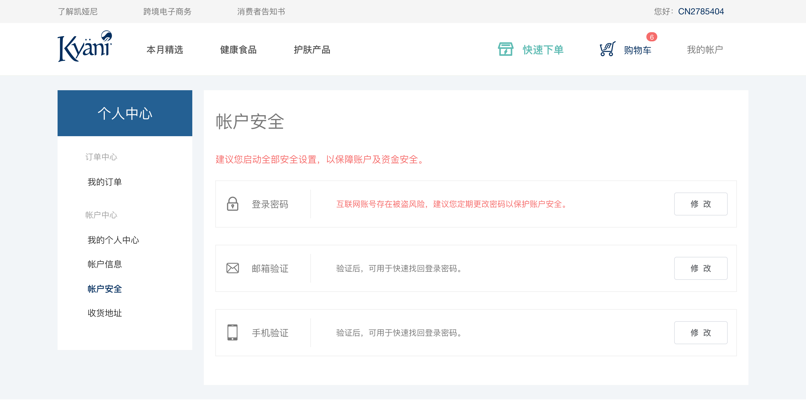

# 帐户安全模块

帐户安全可以保障账户及资金安全，用户可以进行登录密码的修改，邮箱验证和手机验证

<!-- TOC -->

- [帐户安全模块](#帐户安全模块)
  - [页面展示](#页面展示)
  - [函数及调用接口](#函数及调用接口)
  - [功能介绍](#功能介绍)
    - [登录密码](#登录密码)
    - [邮箱验证和手机验证](#邮箱验证和手机验证)

<!-- /TOC -->

## 页面展示



## 函数及调用接口

用户中心页面需要用户新的布局方式`LayoutUser`，在vue-router里面设置如下：

左侧的导航布局包含在`LayoutUser`里面

```js
import LayoutUser from '../views/layout/LayoutUser'

export const constantRouterMap = [
  {
    path: '/user',
    component: LayoutUser,
    redirect: '/user/index',
    children: [{
      path: 'safety',
      name: 'UserSafety',
      component: () => import('@/views/user/UserSafety'),
      meta: {
        requireAuth: true,
        title: '帐户安全'
      }
    },
    {
      ...
    }
  }
]
```

[UserSafety.vue](https://gitlab.kyani.cn/kyani-inc/kyani-shop-pc/blob/master/src/views/user/UserSafety.vue)

在Vue页面 `mounted` 生命周期钩子时分别调用以下几个函数：
- [getData](https://gitlab.kyani.cn/kyani-inc/kyani-shop-pc/blob/master/src/views/user/UserSafety.vue#L66) 获取到当前用户信息的数据后并渲染到页面上。


## 功能介绍

### 登录密码
- 登录密码的修改是需要跳转到`/user/safety/password`这里进行修改，vue页面是：[UserSafetyPassword.vue](https://gitlab.kyani.cn/kyani-inc/kyani-shop-pc/blob/master/src/views/user/UserSafetyPassword.vue)
  
- 要修改密码，用户需要输入原密码，然后再输入新密码即可修改完成

- 修改密码后，系统会重新退出。需要用户用新密码进行登录

- 密码输入框的初始化及验证
  ```js
  data() {
    return {
      ruleForm: {
        password: '',
        newPassword: '',
        confirmPwd: ''
      },
      rules: {
        password: [
          { required: true, message: '请输入您的原密码', trigger: 'blur' },
          { pattern: regPassword, message: '密码必须是数字和英文字母组合,必须有一个大写字母' }
        ],
        newPassword: [
          { required: true, validator: verifyPwd, trigger: 'blur' }
        ],
        confirmPwd: [
          { required: true, validator: verifyConfirmPwd, trigger: ['blur', 'change'] }
        ]
      }
    }
  }
  ```

### 邮箱验证和手机验证
- 由于此功能需要调整，待调整后再补上文档