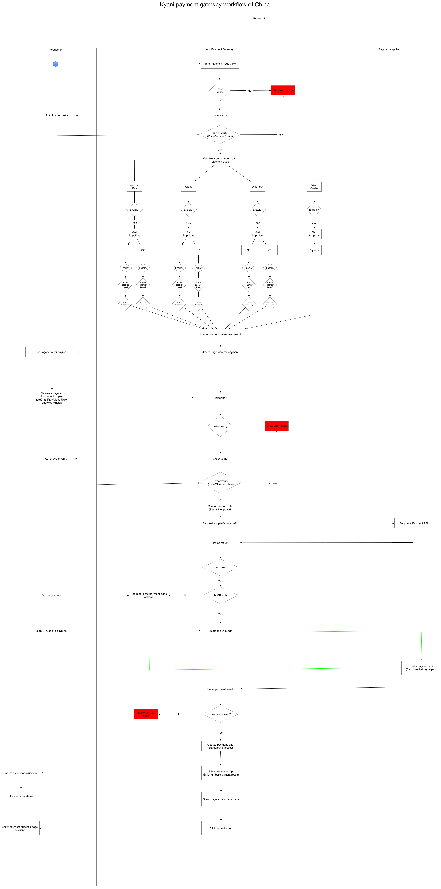

# 支付收银台说明文档

 Payment gateway 是StarsPower里的其中一个模块，是管理支付供应商、支付工具，商城收银台业务的模块。

- [项目部署](./deployment.md)
- [ViewControllers](./viewControllers.md)
- [APIs](./APIs.md)
- [支付工具管理](./paymentInstrument.md)
- [支付供应商管理](./paymentSupplier.md)
- [支付分配设置](./paymentSetting.md)
- [新供应商接入流程](./addSupplier.md)
- [收银台展示](./checkout.md)
  

## 业务流程图

  