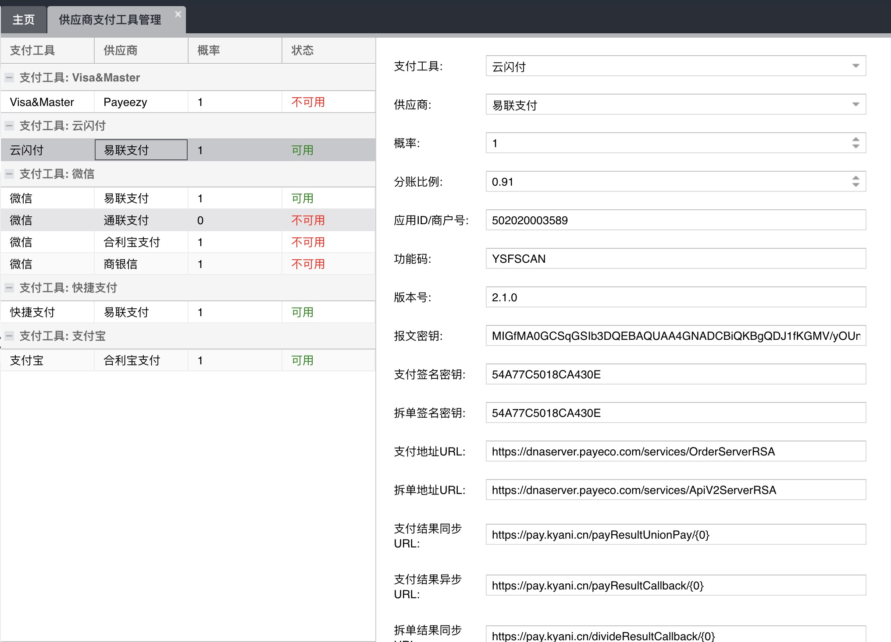

# 支付分配设置

## 页面展示

## 功能介绍

Stars后台的 `财务 - 供应商支付工具` 模块，用于设置各支付工具所对应的供应商，分配概率、开发用参数等。

 概率：选择支付工具支付时选择的供应商概率。如：微信支付下有A和B两个供应商，供应商A概率0.4，供应商B概率0.6，支付时有60%机率流水是在供应商B，40%在供应商A（月配给额未满）。

 分账比例：目前只有易联使用，供财务人员动态设置。

 其他匀为开发人员设置参数，初始后一般不进行改动。

