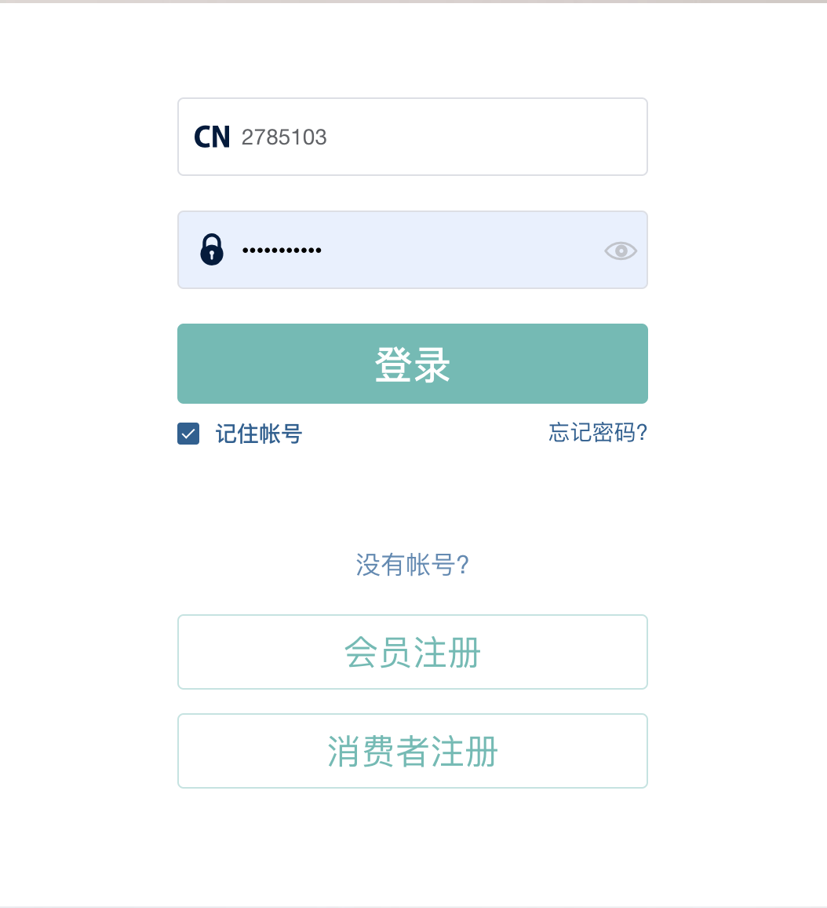

# 登录模块

用户购物前必须得先登录系统，登录系统需要用户名跟密码。当用户名与密码正确时，点击“登录“按钮即可成功登入系统

<!-- TOC -->

- [登录模块](#登录模块)
  - [页面展示](#页面展示)
  - [函数及调用接口](#函数及调用接口)
  - [标题二](#标题二)
    - [标题二标题二](#标题二标题二)

<!-- /TOC -->

## 页面展示

## 函数及调用接口

功能/链接 | 作者 | 图片 
---|---|---
Components:   [AutoshipConfirmationModal.vue](https://note.youdao.com/) | Benson | 

登录模块标题二登录模块标题二登录模块标题二登录模块标题二

## 标题二
标题二标题二标题二标题二标题二标题二标题二标题二标题二标题二

### 标题二标题二
标题二标题二标题二标题二标题二标题二标题二标题二标题二标题二标题二标题二