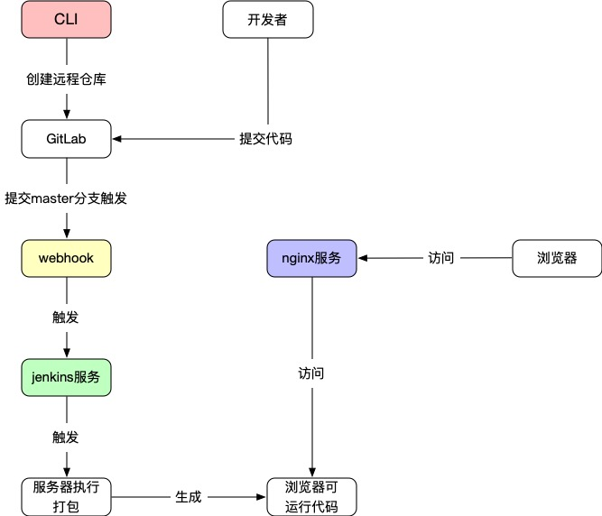

# 部署文档
主要讲解一下开发环境的启动方式与线上环境的部署

需要安装开发环境Node.js, npm

Node.js > v9

npm > v5

<!-- TOC -->

- [部署文档](#部署文档)
  - [开发环境](#开发环境)
  - [线上环境](#线上环境)
    - [基于nginx部署](#基于nginx部署)
    - [基于docker+jenkins+nginx部署](#基于dockerjenkinsnginx部署)
      - [简要部署流程图](#简要部署流程图)

<!-- /TOC -->

## 开发环境

环境安装好后，到项目的根目录下进行包安装
```bash
npm install
```

当前项目中所有用到的包以本地依赖的形式被安装到你的项目中，并且在`package.json`中配置了如下的 npm scripts

```bash
{
  "scripts": {
    "dev": "webpack-dev-server --inline --progress --config build/webpack.dev.conf.js",
  }
}
```

启动开发环境

``` bash
# 开发环境 
npm run dev 
```

当项目启动成功，打开浏览器输入`http://localhost:8990/`即可看到运行成功的项目


## 线上环境

在`package.json`中配置了如下的 npm scripts

```bash
{
  "scripts": {
    "build": "NODE_ENV=production env_config=prod node build/build.js",
  }
}
```

打包正式环境命令

``` bash
# 打包正式环境
npm run build:prod
```

执行完以上命令后稍等一会，待命令执行完后会在当前文件夹下生成一个`dist`目录。`dist`就是线上环境运行所需要的所有文件了

### 基于nginx部署
基于生成的`dist`目录，在本机装好nginx后，只需要配置`nginx.conf`文件指向到当前`dist`目录下重新启动下nginx即可

`nginx.conf`的安装目录一般在 `/usr/local/nginx/conf/nginx.conf` 这个位置
 
 ```nginx
#user  nobody;
worker_processes  1;

events {
    worker_connections  1024;
}

http {
    #设置缓存
    proxy_cache_path  /var/cache/nginx levels=1:2 keys_zone=one:8m max_size=3000m inactive=600m;
    proxy_temp_path /var/tmp;
    include       mime.types;
    default_type  application/octet-stream;
    sendfile        on;
    keepalive_timeout  65;

    #设置Gzip压缩
    gzip on;
    gzip_comp_level 6;
    gzip_vary on;
    gzip_min_length  1k;
    gzip_proxied any;
    gzip_types text/plain application/x-javascript application/javascript text/css application/xml text/javascript image/jpeg image/gif image/png image/svg+xml;
    gzip_buffers 16 8k;

    server {
       listen       80;
       listen       localhost;

       location / {
           root /data/www/shop_pc_clinet/;  // 这个目录的内容就是dist的，只不过是目录名不一样而已
           index  index.html index.htm;
           try_files $uri $uri/ /index.html;  # 配置支持 History 模式
       }
    }

}

 ```

### 基于docker+jenkins+nginx部署

#### 简要部署流程图
