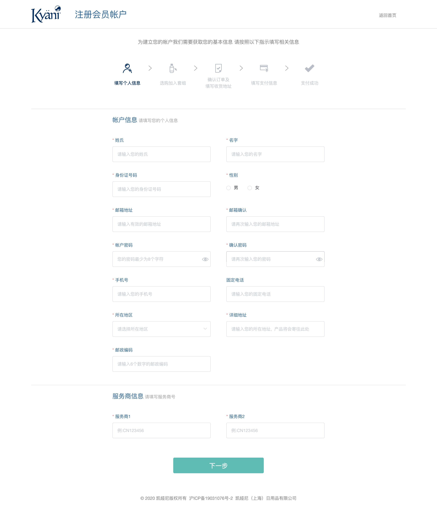

# 会员注册

<!-- TOC -->

- [会员注册](#会员注册)
  - [注册流程](#注册流程)
  - [页面展示 - 步骤一](#页面展示---步骤一)
  - [页面初始化](#页面初始化)
  - [功能介绍](#功能介绍)
    - [1、注册](#1注册)

<!-- /TOC -->

## 注册流程


## 页面展示 - 步骤一


## 页面初始化
当前页面使用了vue.js

当前模块代码位于[AccountRegmember.vue](https://gitlab.kyani.cn/kyani-inc/kyani-shop-pc/blob/master/src/views/account/AccountRegmember.vue)

注册会员需要先在`vuex`里定义基础数据，方便在其它页面可以用。

在[account.js](https://gitlab.kyani.cn/kyani-inc/kyani-shop-pc/blob/master/src/store/modules/account.js)定义vuex数据
```js
const accountRule = {
  firstName: '', // 姓
  lastName: '', // 名
  gender: '', // 性别
  email: '', // 邮箱
  confirmEmail: '', // 确认邮箱
  password: '', // 密码
  confirmPwd: '', // 确认密码
  phoneNumber: '', // 手机号
  telNumber: '', // 固定电话
  idCard: '', // 身份证号码
  cityValue: [], // 省市区数据
  addrDetail: '', // 详细地址
  postcode: '', // 邮政编码
  recommender: '', // 推荐人编号
  reRecommender: '', // 确认推荐人(安置人)
  registerOrderNumber: '' // 注册会员订单编号(重新下单用)
}
// 收货信息表单数据
const receiptRule = {
  consigneeName: '', // 收货人姓名
  idCard: '', // 身份证号码
  phoneNumber: '', // 手机号
  telNumber: '', // 固定电话
  postcode: '', // 邮政编码
  cityValue: [], // 省市区数据
  addrDetail: '' // 详细地址
}

const account = {
  state: {
    accountRule: accountRule, // 会员注册基本信息
    receiptRule: receiptRule, // 会员注册地址信息
  },
}

export default account
```

需要在`store/index`里引入该文件，这样全部页面都可以用得到该数据了
```js
import Vue from 'vue'
import Vuex from 'vuex'
import account from './modules/account'
import getters from './getters'

Vue.use(Vuex)

const store = new Vuex.Store({
  modules: {
    app,
    account
  },
  getters
})

export default store

```
## 功能介绍

### 1、注册
  - 点击此按钮调用[submitForm](https://gitlab.kyani.cn/kyani-inc/kyani-shop-pc/blob/master/src/views/account/AccountRegconsumer.vue#L246)函数对用户输入的所有字段进行验证

  - 如果全部正确则通过调用[_postRegconsumer](https://gitlab.kyani.cn/kyani-inc/kyani-shop-pc/blob/master/src/views/account/AccountRegconsumer.vue#L264)函数进行注册消费者
